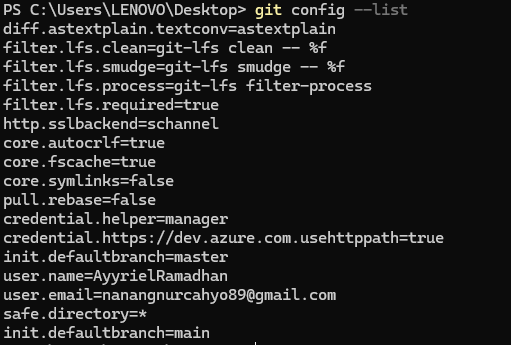

# Praktikum Minggu 01 - Pengenalan Sistem Terdistribusi dan Terdesentralisasi - Git dan GitHub

**Mata Kuliah:** Praktikum Sistem Terdistribusi dan Terdesentralisasi
**Topik:** Git dan Github

---

# 📚 Tujuan Praktikum

1. Memahami cara menginstall git.

2. Memahami cara menggunakan github seperti membuat repository baru.

3. Memahami cara mengkonfigurasi git.

4. Mengetahui cara mengelola repo, baik repo sendiri atau organisasi.

5. Mengetahui perintah git.

---

# 📚 Dasar Teori

**Instalasi Git**

<p align="justify">Git adalah version control system, yaitu alat yang mencatat setiap perubahan yang kita buat pada file atau proyek. Tanpa Git, kita akan kesulitan melacak apa yang sudah diubah, siapa yang mengubahnya, dan kapan perubahan itu terjadi. Di tahap ini kita menginstall Git di komputer agar bisa mulai menggunakan semua fiturnya. Proses instalasinya tidak rumit, tetapi ada beberapa pilihan konfigurasi yang perlu dipahami supaya tidak salah langkah.</p>

**Konfigurasi Git**

<p align="justify">Setelah Git terinstall, hal pertama yang wajib dilakukan adalah mengatur identitas: nama dan email, hal ini dikarenakan setiap kali kita melakukan commit (menyimpan perubahan ke Git), Git akan menyimpan informasi siapa yang membuat perubahan itu. Tanpa konfigurasi ini, commit tidak akan tercatat dengan benar. Konfigurasi ini cukup dilakukan sekali dan akan tersimpan di file <code>.gitconfig</code>.</p>

**Pengelolaan Repository**

<p align="justify">Repository (sering disingkat repo) adalah tempat penyimpanan untuk semua file dan riwayat perubahan dalam sebuah proyek. Satu repo biasanya digunakan untuk satu proyek tertentu. Repo bisa ada di komputer lokal maupun di GitHub, dan keduanya bisa disinkronkan. Di tahap ini kita belajar cara membuat repo, mengisinya dengan file, dan mengelola perubahan di dalamnya.</p>

**Repository pada Account Sendiri**

<p align="justify">Repo bisa dibuat di akun GitHub pribadi kita. Repo seperti ini biasanya untuk proyek pribadi atau pembelajaran. Kita bisa mengaturnya sebagai public (semua orang bisa melihat) atau private (hanya orang yang diberi akses). Prosesnya dimulai dari membuat repo di GitHub, lalu meng-clone-nya ke komputer lokal agar bisa dikerjakan secara offline, dan terakhir meng-push perubahan kembali ke GitHub.</p>

**Repository pada Organisasi**

<p align="justify">Selain di akun pribadi, repo juga bisa dibuat di dalam organisasi di GitHub. Organisasi berguna ketika sebuah proyek dikerjakan oleh beberapa orang dalam satu tim. Semua anggota organisasi bisa mengakses repo yang ada di dalamnya. Cara mengelola repo organisasi sebenarnya sama dengan repo pribadi bedanya hanya pada siapa yang memiliki akses dan siapa yang bertanggung jawab atas repo tersebut.</p>

**Kolaborasi**

<p align="justify">Ini bagian bagaimana beberapa orang bisa bekerja dalam satu proyek tanpa saling mengganggu. Git punya mekanisme branching. Setiap orang bisa membuat cabang sendiri untuk bekerja, lalu menggabungkannya kembali ke cabang utama setelah selesai. GitHub menambahkan fitur pull request, yaitu mekanisme untuk meminta pemilik repo meninjau dan menyetujui perubahan sebelum digabungkan.</p>

---

# ⏩ PEMBAHASAN PRAKTIKUM

## PRAKTIK 1 - INSTALASI GIT

### 1. Download Git dari web resmi


#### Pembahasan

<p align="justify">Langkah pertama adalah mengunduh installer Git dari situs resminya di <strong>git-scm.com</strong>. Penting untuk mengambil installer dari sumber resmi agar mendapatkan versi yang terbaru dan aman. Di halaman download, pilih installer sesuai sistem operasi yang digunakan, dalam hal ini dilakukan pada Windows. File yang diunduh biasanya berformat .exe.</p>

---

### 2. Setelah download Git, double click pada file yang di-download. Akan dimunculkan lisensi. Klik install untuk lanjut.


#### Pembahasan

<p align="justify">Setelah file installer diunduh, double click untuk menjalankannya. Yang pertama muncul adalah halaman lisensi, yaitu perjanjian penggunaan software. Lisensi Git adalah GPL (General Public License), yang berarti Git adalah software open source yang bebas digunakan. Klik <strong>Install</strong> untuk melanjutkan ke langkah berikutnya.</p>

---

### 3. Setelah itu, pilih lokasi instalasi. Secara default akan terisi C:\Program Files\Git. Kemudian klik Next


#### Pembahasan

<p align="justify">Di langkah ini kita diminta memilih folder tempat Git akan diinstall. Secara default, installer menyarankan lokasi <code>C:\Program Files\Git</code>. Lokasi ini merupakan standar untuk aplikasi di Windows, jadi tidak perlu diubah. Yang perlu diingat setelah instalasi selesai, Git akan bisa diakses dari command prompt atau Git Bash dari direktori mana saja.</p>

---

### 4. Pilih komponen. Tidak perlu diubah-ubah, sesuai dengan default saja. Klik pada Next


#### Pembahasan

<p align="justify">Halaman ini menampilkan komponen-komponen Git yang akan diinstall. Secara default, semua komponen penting sudah dicentang seperti Git Bash, Git GUI, dan integrasi dengan Windows Explorer. Tidak ada yang perlu diubah di sini. Cukup klik <strong>Next</strong> dan lanjutkan.</p>

---

### 5. Mengisi shortcut untuk menu Start. Gunakan default (Git)


#### Pembahasan

<p align="justify">Di sini kita diminta memberi nama shortcut untuk menu Start. Default-nya adalah "Git", yang sudah cukup jelas dan mudah dicari. Tidak perlu diubah cukup klik <strong>Next</strong> saja.</p>

---

### 6. Pilih editor yang akan digunakan bersama dengan Git


#### Pembahasan

<p align="justify">Git membutuhkan editor teks untuk menulis pesan commit atau menyelesaikan konflik saat merge. Di langkah ini kita memilih editor mana yang akan dipakai. Jika sudah menginstall Visual Studio Code atau Notepad++, bisa memilih salah satunya. Jika tidak yakin, pilih saja editor default (Vim) nanti tetap bisa diubah lagi melalui konfigurasi Git.</p>

---

### 7. Setiap melakukan inisialisasi repo Git, suatu nama branch akan diberikan. Default nama adalah master tetapi umumnya sekarang diganti dengan main. Ubahlah konfigurasi tersebut:


#### Pembahasan

<p align="justify">Branch adalah cabang dalam repo, setiap repo punya satu branch utama. Dulu, nama default branch utama adalah "master", tetapi sekarang industri beralih ke "main" sebagai standar baru. Di langkah ini kita mengubah pilihan dari "master" ke "main" agar repo yang nanti kita buat langsung menggunakan nama branch yang sesuai dengan kebiasaan saat ini.</p>

---

### 8. Pada saat instalasi, Git menyediakan akses git melalui Bash maupun command prompt. Pilih pilihan kedua supaya bisa menggunakan dari dua antarmuka tersebut. Bash adalah shell di Linux. Dengan menggunakan bash di Windows, pekerjaan di command line Windows bisa dilakukan menggunakan bash - termasuk ekskusi dari Git.


#### Pembahasan

<p align="justify">Git bisa diakses melalui dua antarmuka di Windows yaitu Command Prompt (cmd) dan Git Bash. Git Bash adalah shell yang meniru lingkungan Linux, perintah-perintah Linux bisa langsung dipakai di Windows. Dengan memilih opsi kedua, kita bisa menggunakan Git dari keduanya. Ini berguna karena beberapa perintah Git lebih mudah dijalankan di Git Bash, sementara yang lain cukup lewat Command Prompt biasa.</p>

---

### 9. Pilih native Windows Secure Channel library HTTPS. Git menggunakan https untuk akes ke repo GitHub atau repo-repo lain (GitLab, Assembla).


#### Pembahasan

<p align="justify">Git berkomunikasi dengan repo remote (seperti GitHub) melalui protokol HTTPS. Di langkah ini kita memilih library yang akan digunakan untuk koneksi HTTPS tersebut. Pilihan "native Windows Secure Channel library" berarti Git akan menggunakan sistem keamanan bawaan Windows, pilihan ini merupakan pilihan yang paling stabil dan kompatibel untuk pengguna Windows.</p>

---

### 10. Pilih pilihan pertama untuk konversi akhir baris (CR-LF).


#### Pembahasan

<p align="justify">Windows dan Linux menggunakan karakter berbeda untuk menandai akhir baris (line ending). Windows menggunakan CR+LF, sedangkan Linux hanya LF. Jika tidak dikonversi dengan benar, file yang diedit di Windows bisa terlihat berantakan saat dibuka di Linux, dan sebaliknya. Pilihan pertama memastikan Git secara otomatis mengkonversi line ending agar file tetap konsisten lintas platform.</p>

---

### 11. Pilih MinTTY untuk terminal yang digunakan untuk mengakses Git Bash.


#### Pembahasan

<p align="justify">MinTTY adalah emulator terminal ringan yang digunakan untuk menjalankan Git Bash. Terminal ini mendukung fitur-fitur modern seperti resize window, copy-paste, dan tampilan yang lebih baik dibanding terminal bawaan Windows. Pilih MinTTY agar pengalaman menggunakan Git Bash lebih nyaman.</p>

---

### 12. Tetapkan perilaku standar dari git pull. Pilih default saja yaitu Fast-forward or merge.


#### Pembahasan

<p align="justify"><code>git pull</code> adalah perintah untuk mengambil perubahan dari repo remote dan menggabungkannya ke branch lokal. Ada beberapa strategi penggabungan, tetapi default "Fast-forward or merge" adalah yang paling umum dan aman untuk pemula.</p>

---

### 13. Memilih credential helper.


#### Pembahasan

<p align="justify">Credential helper adalah komponen yang menyimpan kredensial login kita saat mengakses repo remote. Tanpa ini, kita akan diminta memasukkan username dan password setiap kali melakukan push atau pull. Dengan credential helper, kredensial disimpan secara aman sehingga kita tidak perlu login berulang kali. Pilih default (Git Credential Manager).</p>

---

### 14. Untuk opsi ekstra, pilih serta aktifkan file system caching.


#### Pembahasan

<p align="justify">File system caching adalah fitur yang membuat Git lebih cepat dalam membaca dan menulis file. Secara default, Git memeriksa setiap file satu per satu dengan caching, proses ini dioptimalkan sehingga operasi Git (seperti <code>git status</code> atau <code>git add</code>) terasa lebih responsif, terutama di repo yang besar. Centang opsi ini untuk performa yang lebih baik.</p>

---

### 15. Setelah itu proses instalasi akan dilakukan.


<p align="justify">Tunggu hingga proses instalasi selesai. Setelah proses selesai, lalu klik: <strong>Finish</strong></p>


#### Pembahasan

<p align="justify">Sekarang installer mulai menyalin file-file Git ke komputer. Proses ini biasanya memakan waktu 1-3 menit tergantung kecepatan komputer. Setelah selesai, klik <strong>Finish</strong> untuk menutup installer. Git sekarang sudah terinstall dan siap digunakan.</p>

---

### 16. Mengecek Instalasi Git


#### Pembahasan

<p align="justify">Setelah instalasi selesai, kita perlu memastikan bahwa Git benar-benar terinstall dengan benar. Caranya buka Command Prompt atau Git Bash, lalu ketik perintah <code>git</code>. Jika Git terinstall dengan benar, akan muncul daftar perintah-perintah Git yang tersedia. Jika tidak, mungkin ada masalah pada PATH environment variable.</p>

---

### 17. Mengecek Versi git

```
git --version
```


#### Pembahasan

<p align="justify">Perintah <code>git --version</code> digunakan untuk memeriksa versi Git yang terinstall. Jika muncul output seperti <code>git version 2.56.0</code>, berarti instalasi berhasil. Versi yang muncul bisa berbeda-beda tergantung kapan Git diunduh. Jika muncul pesan "command not found", berarti Git belum terinstall dengan benar atau PATH belum dikonfigurasi.</p>

---

## PRAKTIK 2 - KONFIGURASI GIT

### 1. Konfigurasi Username

```
git config --global user.name "Nama Anda di GitHub"
```


#### Pembahasan

<p align="justify">Perintah ini mengatur nama yang akan tercantum di setiap commit yang kita buat. Gunakan nama yang sama dengan nama di akun GitHub agar mudah dikenali. Opsi <code>--global</code> berarti konfigurasi ini berlaku untuk semua repo di komputer ini.</p>

---

### 2. Membuat Konfigurasi Email

```
git config --global user.email email@domain.tld
```


#### Pembahasan

<p align="justify">Sama seperti username, email juga akan tercantum di setiap commit. Gunakan email yang sama dengan email yang didaftarkan ke akun GitHub. Ini penting karena GitHub menggunakan email untuk mencocokkan commit dengan akun kita. Jika email tidak cocok, commit tidak akan terhubung ke profil GitHub kita.</p>

---

### 3. Melihat Konfigurasi

```
cat ~/.gitconfig
```


#### Pembahasan

<p align="justify">Perintah <code>cat ~/.gitconfig</code> menampilkan isi file konfigurasi Git. Di sini kita bisa melihat nama dan email yang sudah diatur sebelumnya. File <code>.gitconfig</code> tersimpan di folder home user dan berisi semua konfigurasi global Git.</p>

---

```
git config --list
```



#### Pembahasan

<p align="justify">Perintah <code>git config --list</code> menampilkan semua konfigurasi Git yang aktif, termasuk yang bawaan dari sistem. Outputnya lebih lengkap daripada <code>cat ~/.gitconfig</code> karena mencakup konfigurasi dari berbagai sumber.</p>

---

## PRAKTIK 3 - MENGELOLA REPO SENDIRI

### 1. Klik tanda + pada bagian atas setelah login, pilih **_New repository_**


#### Pembahasan

<p align="justify">Setelah login ke GitHub, kita bisa membuat repository baru dengan mengklik tanda <strong>+</strong> di pojok kanan atas halaman. Dari menu yang muncul, pilih <strong>New repository</strong>. Ini adalah langkah awal untuk membuat tempat penyimpanan proyek kita di GitHub.</p>

---

### 2. Isikan nama, keterangan, serta lisensi.


#### Pembahasan

<p align="justify">Di halaman ini kita mengisi detail repository: nama repo, deskripsi singkat, dan lisensi. Nama repo sebaiknya deskriptif dan mudah diingat. Lisensi. Opsi untuk membuat repo private (hanya bisa diakses oleh kita) atau public (semua orang bisa melihat). Setelah semua isian lengkap, klik <strong>Create repository</strong></p>

---

### 3. Hasil Pembuatan Repository


#### Pembahasan

<p align="justify">GitHub akan langsung membuat repo dan menampilkan halaman repo tersebut. Jika kita memilih opsi default (tanpa README, .gitignore, atau LICENSE), repo akan kosong dan GitHub akan menampilkan petunjuk untuk mulai mengisi repo dari command line. Tapi karena di langkah sebelumnya sudah ditambah README.md jadi isinya tidak kosong.</p>

---

### 4. Clone Repo

<p align="justify">Gunakan perintah berikut:</p>

```
git clone <URL Link Repo>
```

<p align="justify">Contoh:</p>


#### Pembahasan

<p align="justify"><code>Perintah git clone</code> adalah perintah untuk menduplikasi repo dari GitHub ke komputer lokal. URL repo bisa ditemukan di halaman repo GitHub. Caranya klik tombol <strong>Code</strong> lalu salin URL HTTPS. Setelah perintah ini dijalankan, akan muncul folder baru di komputer yang berisi salinan repo tersebut. Di dalam folder itu ada folder tersembunyi <code>.git</code> yang menyimpan semua riwayat perubahan.</p>

---

### 5. Masuk ke Folder Repository

<p align="justify">Setelah meng-clone repository tadi, masuk ke folder repository menggunakan perintah:</p>

```
cd nama-repository
```

<p align="justify">Contoh:</p>

```
cd .\prac-dis-dec-Membuat-Repository\
```


#### Pembahasan

<p align="justify">Setelah clone selesai, kita perlu masuk ke folder repo untuk mulai bekerja. Perintah <code>cd</code> (change directory) digunakan untuk berpindah ke folder tersebut. Setelah masuk, semua perintah Git yang kita jalankan akan berlaku di repo ini. Untuk memastikan kita sudah di folder yang benar, bisa cek dengan perintah <code>ls</code> (Linux/Mac) atau <code>dir</code> (Windows).</p>

---

### 6. Mengubah isi dengan Branching and Merging


#### Pembahasan

<p align="justify">Branching and merging adalah cara aman melakukan perubahan. Alih-alih langsung mengedit file di branch utama (main), kita membuat branch baru semacam "cabang" terpisah untuk menampung perubahan. Setelah perubahan selesai dan diuji, branch tersebut digabungkan kembali ke main melalui pull request. Cara ini lebih terstruktur dan memungkinkan orang lain meninjau perubahan sebelum akhirnya masuk ke branch utama. Di GitHub, proses ini dilakukan dengan membuat branch, push ke repo, lalu membuat pull request untuk menggabungkannya.</p>

---

### 7. Perintah-Perintah Git untuk Mengelola Repo

<p align="justify">Setelah repo di-clone, semua pekerjaan dilakukan di komputer lokal menggunakan perintah-perintah Git. Berikut adalah perintah-perintah yang paling sering digunakan:</p>

**Memastikan branch utama**

```
git branch -m main
```

<p align="justify">Perintah ini mengubah nama branch utama dari "master" menjadi "main". Ini perlu dilakukan sekali setelah clone, karena Git lokal masih menggunakan nama lama secara default. Setelah diubah, semua commit baru akan masuk ke branch "main".</p>

**Cek status repo**

```
git status
```

<p align="justify">Sebelum melakukan apa pun, biasakan cek <code>git status</code> terlebih dahulu. Perintah ini menunjukkan branch mana yang sedang aktif, ada file apa saja yang berubah, dan apakah perubahan sudah di-staging atau belum. Ini seperti "cek kondisi" sebelum mulai bekerja.</p>

**Staging perubahan**

```
git add -A
```

<p align="justify">Setelah edit file, perubahan belum otomatis masuk ke commit. Kita perlu menandainya dulu ke staging area — semacam "keranjang sementara" sebelum perubahan disimpan secara permanen. <code>git add -A</code> berarti semua perubahan (file baru, file diedit, file dihapus) akan dimasukkan ke staging area.</p>

**Commit perubahan**

```
git commit -m "pesan perubahan"
```

<p align="justify">Commit adalah menyimpan snapshot perubahan ke riwayat Git. Setiap commit harus disertai pesan yang jelas agar orang lain (dan kita sendiri di masa depan) tahu apa yang diubah. Pesan yang baik biasanya diawali kata kerja, misalnya "Add: README.md" atau "Fix: typo pada dokumentasi".</p>

**Push ke GitHub**

```
git push origin main
```

<p align="justify">Perintah ini mengirim semua commit yang ada di komputer lokal ke repo GitHub. <code>origin</code> adalah nama default untuk remote repo (repo GitHub), dan <code>main</code> adalah branch tujuan. Setelah push berhasil, perubahan akan terlihat di GitHub.</p>

---

**Alur push lengkap dengan branching:**

<p align="justify">Alur di bawah ini menunjukkan cara aman mengirim perubahan ke GitHub menggunakan branching and merging:</p>

1. <strong>Buat branch baru</strong> — <code>git checkout -b nama-branch</code>
   <p align="justify">Kita membuat branch terpisah untuk menampung perubahan. Ini agar branch utama (main) tetap bersih selama kita bekerja.</p>

2. <strong>Edit file</strong> — lakukan perubahan pada file di komputer lokal menggunakan editor teks.

3. <strong>Cek status</strong> — <code>git status</code>
   <p align="justify">Pastikan perubahan yang kita buat terdeteksi oleh Git.</p>

4. <strong>Staging</strong> — <code>git add -A</code>
   <p align="justify">Tandai semua perubahan ke staging area.</p>

5. <strong>Commit</strong> — <code>git commit -m "pesan perubahan"</code>
   <p align="justify">Simpan perubahan ke branch tersebut dengan pesan yang jelas.</p>

6. <strong>Push branch</strong> — <code>git push origin nama-branch</code>
   <p align="justify">Kirim branch yang berisi perubahan ke GitHub. GitHub akan memberikan URL untuk membuat pull request.</p>

7. <strong>Buat pull request</strong> — buka URL yang diberikan GitHub, isi deskripsi perubahan, lalu klik <strong>Create pull request</strong>.

8. <strong>Merge di GitHub</strong> — setelah pull request ditinjau dan disetujui, klik <strong>Merge pull request</strong> lalu <strong>Confirm merge</strong>.

9. <strong>Kembali ke main</strong> — <code>git checkout main</code>
   <p align="justify">Setelah branch di-merge, kita kembali ke branch utama.</p>

10. <strong>Merge ke main</strong> — <code>git merge nama-branch</code>
    <p align="justify">Gabungkan perubahan dari branch tadi ke branch main secara lokal.</p>

11. <strong>Hapus branch</strong> — <code>git branch -D nama-branch</code>
    <p align="justify">Branch yang sudah di-merge tidak perlu disimpan lagi, jadi bisa dihapus.</p>

12. <strong>Sinkronisasi</strong> — <code>git pull</code>
    <p align="justify">Terakhir, tarik perubahan terbaru dari GitHub agar repo lokal selalu up to date.</p>

<p align="justify">Dengan mengikuti alur ini, setiap perubahan yang masuk ke branch utama sudah melalui proses review dan teruji. Ini adalah standar kerja yang digunakan di pengembangan software profesional.</p>

---

# 📝 Kesimpulan

<p align="justify">Setelah mengikuti seluruh rangkaian praktikum ini, saya jadi paham bahwa Git dan GitHub bukan sekadar tools untuk menyimpan file. Git mencatat setiap perubahan secara terstruktur sehingga kita bisa melacak riwayat proyek, kembali ke versi sebelumnya jika ada kesalahan, dan bekerja tanpa takut merusak file yang sudah ada. GitHub menambahkan dimensi kolaborasi: repo bisa diakses dari mana saja, perubahan bisa ditinjau sebelum digabungkan, dan beberapa orang bisa bekerja dalam satu proyek tanpa saling menimpa.</p>

<p align="justify">Kesimpulannya, Git dan GitHub adalah keterampilan dasar yang wajib dimiliki siapa pun yang terjun ke pengembangan software. Praktikum ini memberikan fondasi yang kuat untuk memahami version control dan kolaborasi tim.</p>

---

## 🗒️ Referensi

<p align="justify">Materi praktikum mengacu pada dokumentasi Git dan GitHub serta materi petunjuk penggunaan Git dan GitHub dari repository NEO-X-School (https://github.com/NEO-X-School/notes/tree/main/petunjuk-git-github).</p>
