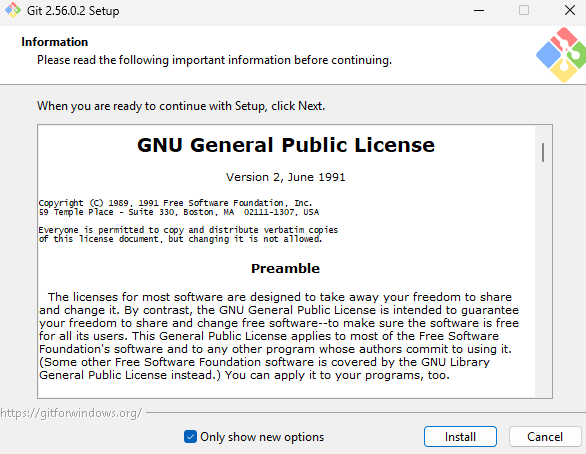
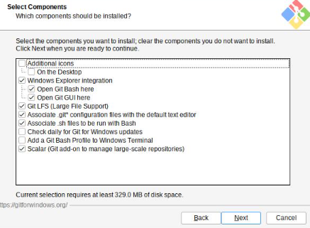
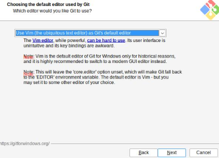
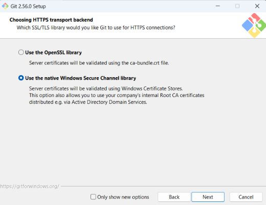
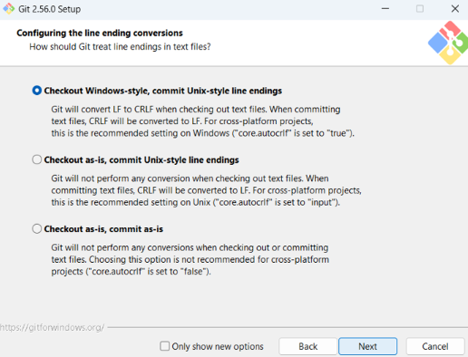
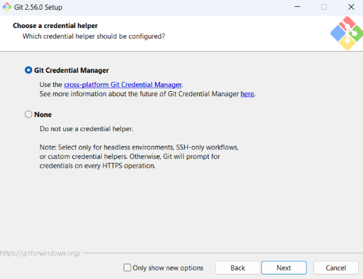
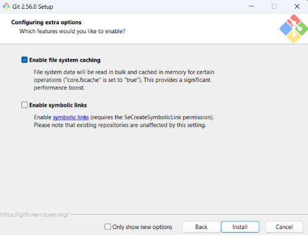
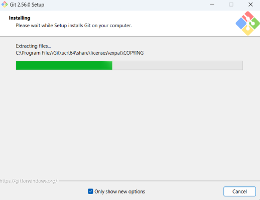
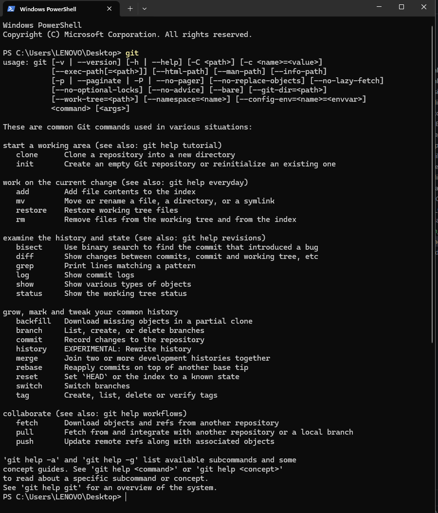
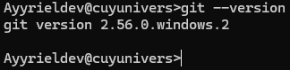

# Praktikum Minggu 01-Pengenalan Sistem Terdistribusi dan Terdesentralisasi - Git dan GitHub

**Mata Kuliah:** Praktikum Sistem Terdistribusi dan Terdesentralisasi
**Topik:** Git dan Github

---

# 📚 Tujuan Praktikum

Praktikum ini bertujuan untuk:

1. Memahami fungsi dasar Git dan GitHub.
2. Melakukan instalasi Git pada komputer.
3. Melakukan konfigurasi identitas pengguna Git.
4. Membuat dan mengelola repository.
5. Menghubungkan repository lokal dengan GitHub.
6. Melakukan commit dan mengunggah perubahan ke repository.
7. Memahami dasar kolaborasi menggunakan Git dan GitHub.

---

# 📚Dasar Teori

Materi yang dipelajari dalam praktikum meliputi:

1. Instalasi Git
   Pada tahap ini dilakukan instalasi Git pada komputer. Git digunakan untuk mengelola perubahan pada file dan project secara terstruktur.

2. Konfigurasi Git
   Setelah Git berhasil diinstal, dilakukan konfigurasi nama pengguna dan email. Konfigurasi ini digunakan untuk mengidentifikasi pengguna ketika melakukan commit.

3. Pengelolaan Repository
   Tahap ini membahas pembuatan dan pengelolaan repository. Repository dapat digunakan untuk menyimpan source code, dokumentasi, dan file project lainnya.

4. Repository pada Account Sendiri
   Materi ini membahas cara mengelola repository yang berada pada akun GitHub pribadi, mulai dari membuat repository sampai melakukan sinkronisasi dengan repository lokal.

5. Repository pada Organisasi
   Materi ini membahas penggunaan repository yang berada dalam organisasi. Repository organisasi dapat digunakan ketika beberapa pengguna bekerja dalam satu kelompok atau project.

6. Kolaborasi
   Tahap terakhir membahas penggunaan Git dan GitHub untuk bekerja secara bersama-sama dalam sebuah project. Setiap anggota dapat melakukan perubahan pada project dan mengelola perubahan tersebut menggunakan Git.

---

# ⏩ PEMBAHASAN PRAKTIKUM

## PRAKTIK 1 - INSTALASI GIT

1.  Instalasi Git (Windows)
    Alur praktikum yang dilakukan adalah:

    a. Download Git dari web resmi

       

    b. Setelah download Git, double click pada file yang di-download. Akan dimunculkan lisensi. Klik install untuk lanjut.

       

    c. Setelah itu, pilih lokasi instalasi. Secara default akan terisi C:\Program Files\Git. Kemudian klik Next

    

    d. Pilih komponen. Tidak perlu diubah-ubah, sesuai dengan default saja. Klik pada Next

    

    e. Mengisi shortcut untuk menu Start. Gunakan default (Git)

    

    f. Pilih editor yang akan digunakan bersama dengan Git

    

    g. Setiap melakukan inisialisasi repo Git, suatu nama branch akan diberikan. Default nama adalah master tetapi umumnya sekarang diganti dengan main. Ubahlah konfigurasi tersebut:

    

    h. Pada saat instalasi, Git menyediakan akses git melalui Bash maupun command prompt. Pilih pilihan kedua supaya bisa menggunakan dari dua antarmuka tersebut. Bash adalah shell di Linux. Dengan menggunakan bash di Windows, pekerjaan di command line Windows bisa dilakukan menggunakan bash - termasuk ekskusi dari Git.

    

    i. Pilih native Windows Secure Channel library HTTPS. Git menggunakan https untuk akes ke repo GitHub atau repo-repo lain (GitLab, Assembla).

       
       
    j. Pilih pilihan pertama untuk konversi akhir baris (CR-LF).

       

    K. Pilih MinTTY untuk terminal yang digunakan untuk mengakses Git Bash.

      

    L. Tetapkan perilaku standar dari git pull. Pilih default saja yaitu Fast-forward or merge.

      

    M. Memilih credential helper.

     

    N. Untuk opsi ekstra, pilih serta aktifkan file system caching.

     

    O. Setelah itu proses instalasi akan dilakukan.

      

    tunggu hingga proses intalasi selesai. Setelah proses selesai,klik: **Finish**

     

    P. Mengecek Instalasi Git

      

    Q. Mengecek Versi git

    `git --version`

      

Konfigurasi Git ✅

          ↓

Mengelola Repository Sendiri Account ✅

      ↓

Mengelola Repository Sendiri Organinsasi ✅

      ↓

Mengelola Repository Sendiri ✅

      ↓

Kolaborasi ✅

📢 Beberapa perintah dasar Git yang dipelajari dalam praktikum antara lain:

git config

git init

git clone

git status

git add

git commit

git remote

git push

git pull

Perintah tersebut digunakan untuk mengatur Git, membuat repository lokal, memeriksa perubahan, menyimpan perubahan melalui commit, serta melakukan sinkronisasi dengan repository GitHub.

🤜🏼 Hasil Praktikum

Setelah melakukan praktikum, diperoleh pemahaman mengenai penggunaan Git dan GitHub untuk mengelola project. Repository lokal dapat dihubungkan dengan GitHub sehingga perubahan file dapat disimpan dan dikelola secara online.

Praktikum juga memberikan pemahaman mengenai proses dasar version control, yaitu melakukan perubahan file, mencatat perubahan melalui commit, kemudian mengirimkan perubahan tersebut ke repository GitHub menggunakan perintah git push.

📝 Kesimpulan

Praktikum Git dan GitHub memberikan pemahaman dasar mengenai pengelolaan project menggunakan version control. Git digunakan untuk mencatat dan mengelola perubahan pada project, sedangkan GitHub digunakan untuk menyimpan repository secara online dan mendukung proses kolaborasi.

🗒️ Referensi

Materi praktikum mengacu pada dokumentasi Git dan GitHub serta materi petunjuk penggunaan Git dan GitHub dari repository NEO-X-School (https://github.com/NEO-X-School/notes/tree/main/petunjuk-git-github).
