# Praktikum Minggu 02 - Komunikasi Antar Proses pada Sistem Terdistribusi

**Mata Kuliah:** Praktikum Sistem Terdistribusi dan Terdesentralisasi
**Topik:** Komunikasi Antar Proses pada Sistem Terdistribusi

---

# 📚 Tujuan Praktikum

1. ...
2. ....
3. .....

---

# 📚 Dasar Teori

---

# ⏩ PEMBAHASAN PRAKTIKUM

## PRAKTIK 1 - PROSES PADA SATU NODE

### 1. Tampilkan berbagai proses yang ada pada Laptop-Windows


#### Pembahasan

---

### 2. Jalankan salah satu aplikasi kemudian perlihatkan proses yang dimunculkan oleh aplikasi

Sebagai contoh menjalankan Notepad untuk percobaan:

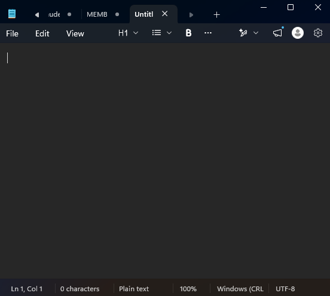

Kemudian untuk melihat proses yang dimunculkan aplikasi tersebut dapat dilihat pada task manager, yaitu sebagai berikut :

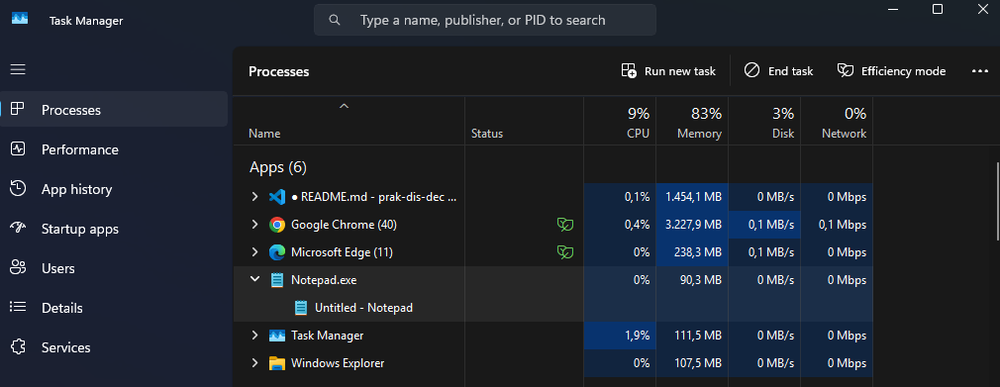

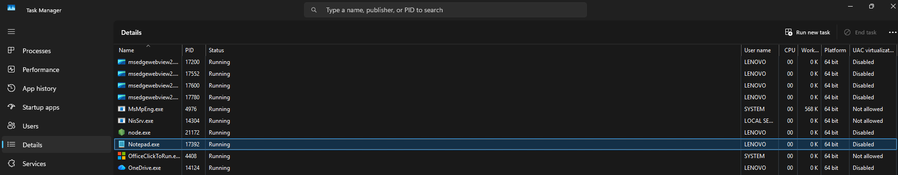

#### Pembahasan

---

### 3. Merestart dan Mematikan proses yang dimunculkan oleh aplikasi

1. Untuk mematikan proses dapat dilakukan melalui Task Manager:

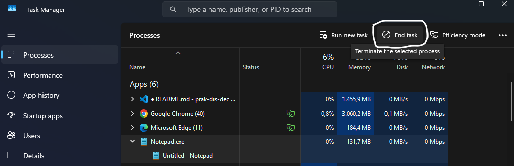

#### Pembahasan

---

Kemudian dapat dilakukan juga melalu CMD:

Untuk melihat daftar proses yang sedang berjalan di Windows gunakan perintah:

```
tasklist
```

#### Pembahasan

---

Untuk mencari proses dari aplikasi gunakan perintah:

```
tasklist | findstr /i "Nama_Aplikasi"
```

Contoh :

```
tasklist | findstr /i notepad
```

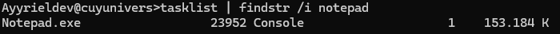

#### Pembahasan

---

Untuk mematikan proses dapat menggunakan perintah

```
taskkill /IM nama_proses.exe /F
```

Contoh :

```
taskkill /IM notepad.exe /F
```


#### Pembahasan

---

Untuk memastikan proses berhenti. Gunakan Perintah:

```
tasklist | findstr /i "Nama_Aplikasi"
```

Contoh :


#### Pembahasan

---

2. Merestart Proses

Untuk merestart proses dapat dilakukan dengan perintah

```
start "" notepad
```

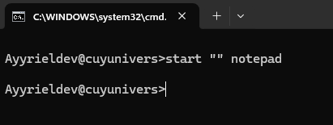

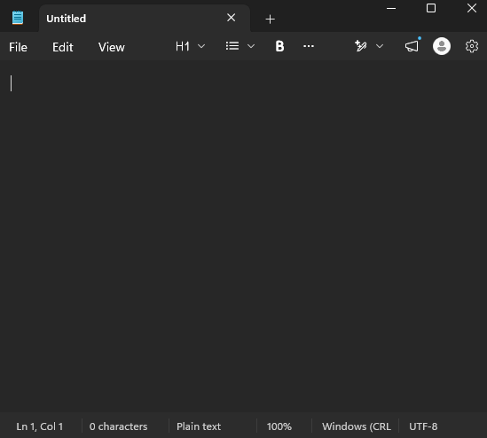

#### Pembahasan

---

## PRAKTIK 2 - KOMUNIKASI ANTAR PROSES pada SISTEM TERDISTRIBUSI

### 1. Instalasi

Petunjuk lengkap instalasi ada di https://docs.astral.sh/uv/getting-started/installation/. Sesuaikan dengan sistem operasi yang digunakan. Berikut adalah contoh di Windows:

```
PS C:\WINDOWS\system32> powershell -ExecutionPolicy ByPass -c "irm https://astral.sh/uv/install.ps1 | iex"
downloading uv 0.13.0 (x86_64-pc-windows-msvc)
installing to C:\Users\LENOVO\.local\bin
  uv.exe
  uvx.exe
  uvw.exe
everything's installed!

To add C:\Users\LENOVO\.local\bin to your PATH, either restart your shell or run:

    set Path=C:\Users\LENOVO\.local\bin;%Path%   (cmd)
    $env:Path = "C:\Users\LENOVO\.local\bin;$env:Path"   (powershell)
PS C:\WINDOWS\system32> $env:Path = "C:\Users\LENOVO\.local\bin;$env:Path"
PS C:\WINDOWS\system32> uv
An extremely fast Python package manager.
```

#### Pembahasan

---

Setelah mengatur env variabel untuk uv ($PATH harus berisi - salah satunya - tempat uv di install) yaitu di (C:\Users\LENOVO\.local\bin), uv bisa dijalankan sebagai berikut:

```
PS C:\WINDOWS\system32> uv
An extremely fast Python package manager.

Usage: uv.exe [OPTIONS] <COMMAND>

Commands:
  auth       Manage authentication
  run        Run a command or script
  init       Create a new project
  add        Add dependencies to the project
  remove     Remove dependencies from the project
  version    Read or update the project's version
  sync       Update the project's environment
  lock       Update the project's lockfile
  export     Export the project's lockfile to an alternate format
  tree       Display the project's dependency tree
  format     Format Python code in the project
  check      Run checks on the project
  audit      Audit the project's dependencies
  tool       Run and install commands provided by Python packages
  python     Manage Python versions and installations
  pip        Manage Python packages with a pip-compatible interface
  venv       Create a virtual environment
  build      Build Python packages into source distributions and wheels
  publish    Upload distributions to an index
  workspace  Inspect uv workspaces
  cache      Manage uv's cache
  self       Manage the uv executable
  help       Display documentation for a command

Cache options:
  -n, --no-cache               Avoid reading from or writing to the cache, instead using a temporary directory for the
                               duration of the operation [env: UV_NO_CACHE=]
      --cache-dir <CACHE_DIR>  Path to the cache directory [env: UV_CACHE_DIR=]

Python options:
      --managed-python       Require use of uv-managed Python versions [env: UV_MANAGED_PYTHON=]
      --no-managed-python    Disable use of uv-managed Python versions [env: UV_NO_MANAGED_PYTHON=]
      --no-python-downloads  Disable automatic downloads of Python. [env: "UV_PYTHON_DOWNLOADS=never"]

Global options:
  -q, --quiet...
          Use quiet output
  -v, --verbose...
          Use verbose output
      --color <COLOR_CHOICE>
          Control the use of color in output [possible values: auto, always, never]
      --system-certs
          Whether to load TLS certificates from the platform's native certificate store [env: UV_SYSTEM_CERTS=]
      --offline
          Disable network access [env: UV_OFFLINE=]
      --allow-insecure-host <ALLOW_INSECURE_HOST>
          Allow insecure connections to a host [env: UV_INSECURE_HOST=]
      --no-progress
          Hide all progress outputs [env: UV_NO_PROGRESS=]
      --directory <DIRECTORY>
          Change to the given directory prior to running the command [env: UV_WORKING_DIR=]
      --project <PROJECT>
          Discover a project in the given directory [env: UV_PROJECT=]
      --config-file <CONFIG_FILE>
          The path to a `uv.toml` file to use for configuration [env: UV_CONFIG_FILE=]
      --no-config
          Avoid discovering configuration files (`pyproject.toml`, `uv.toml`) [env: UV_NO_CONFIG=]
  -h, --help
          Display the concise help for this command
  -V, --version
          Display the uv version

Use `uv help` for more details.
```

#### Pembahasan

---

### 2. Update

Update diperlukan jika menginginkan tetap menggunakan versi terbaru dari uv.

Gunakan Perintah:

```
uv self update
```

Contoh:

```
PS C:\WINDOWS\system32> uv self update
info: Checking for updates...
success: You're already on version v0.13.0 of uv (the latest version).
```

#### Pembahasan

---

### 3. Membuat Workspace

Buat Direktori terlebih dahulu

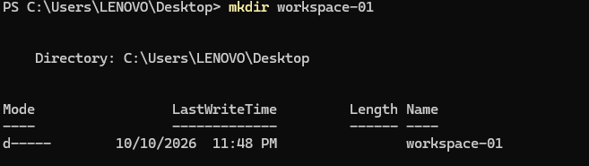

#### Pembahasan

---

Kemudian masuk kedalam direktori


#### Pembahasan

---

Lalu cek versi python yang ingin digunakan. Jika versi Python yang diinginkan belum ada, akan dilakukan download dan instalasi lebih dulu. Untuk cek versi python dapat dilakukan dengan cara:

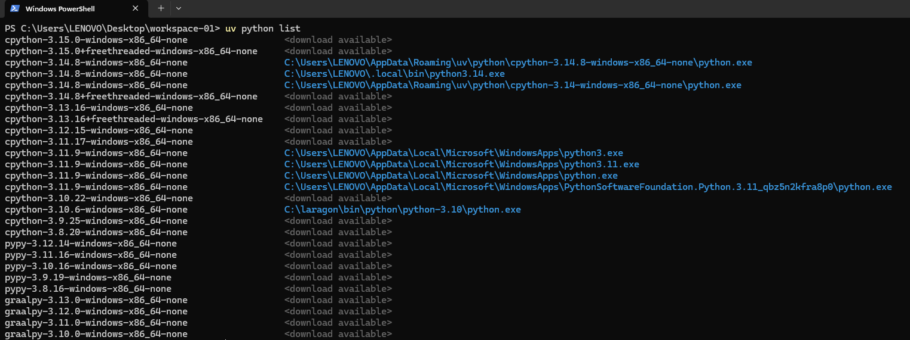

#### Pembahasan

---

Pada direktori tersebut, akan dibuat file .python-version:

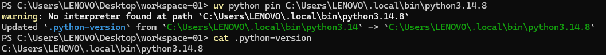

#### Pembahasan

---

### 4. Buat Environment

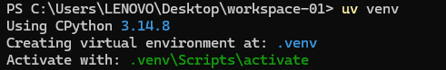

#### Pembahasan

---

Kemudian Mengaktifkan dengan perintah

```
.\.venv\Scripts\Activate
```

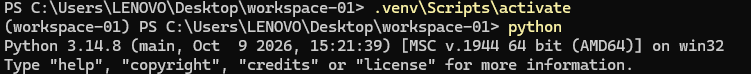

#### Pembahasan

---

Lalu jika ingin keluar dari env. Gunakan perintah:

```
deactivate
```

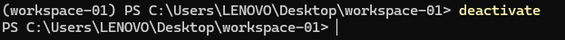

#### Pembahasan

---

### 5. Mengelola Paket

Paket pertama yaitu pandas, untuk menginstall nya dapat menggunakan perintah

```
uv pip install pandas
```

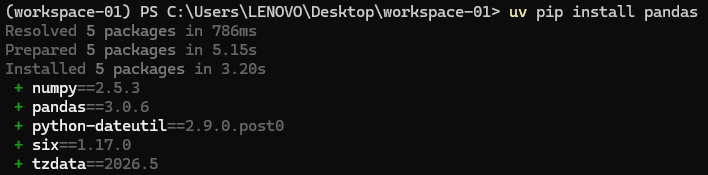

#### Pembahasan

---

Paket kedua yaitu untuk GraphQL, menggunakan perintah

```
uv pip install "strawberry-graphql[cli]"
```

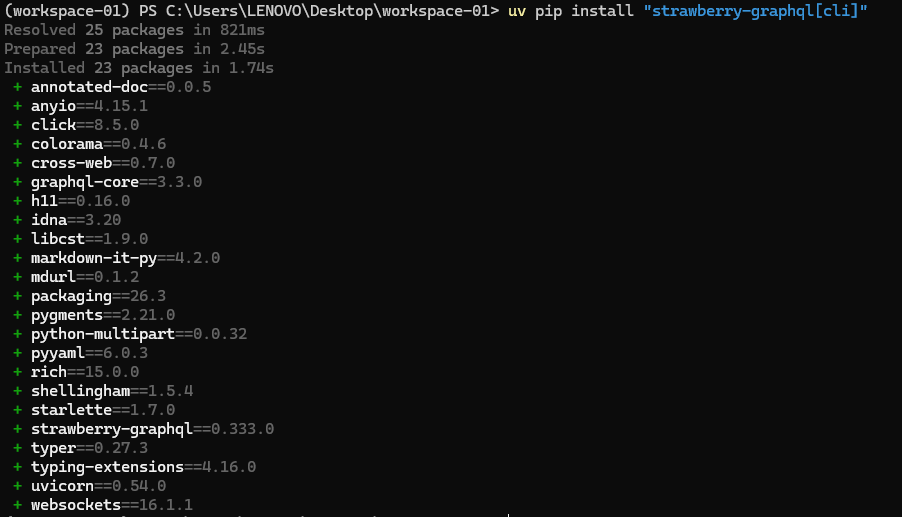

#### Pembahasan

---

Lalu untuk melihat paket yang terpasang menggunakan perintah

```
uv pip list
```

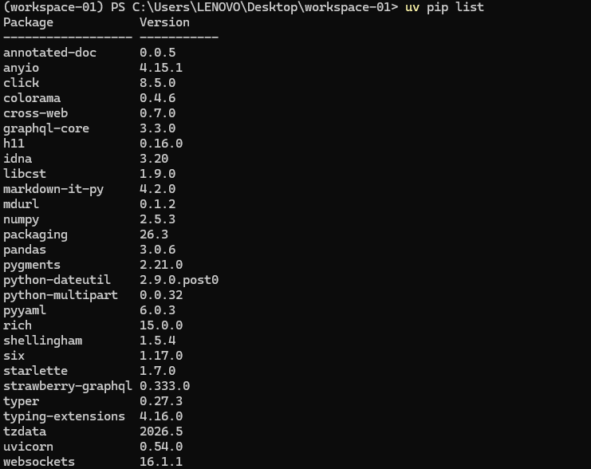

#### Pembahasan

---

Untuk menyimpan daftar paket ke requirements.txt gunakan perintah

```
uv pip freeze > requirements.txt
```

#### Pembahasan

---

Kemudian untuk melihat isi file nya dapat menggunakan perintah

```
cat requirements.txt
```

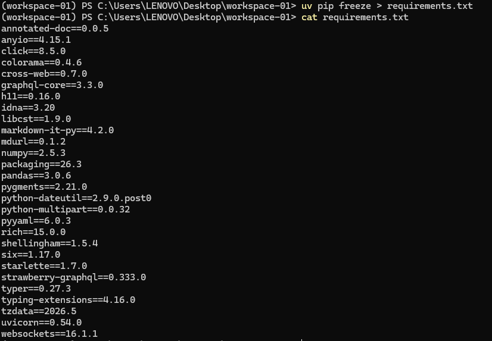

#### Pembahasan

---

### 5. Menjalankan source code yang sudah disediakan pada https://strawberry.rocks/docs

1. Mendefinisikan skema

Buat file bernama schema.py dengan isi sebagai berikut

```
import typing
import strawberry


@strawberry.type
class Book:
    title: str
    author: str


@strawberry.type
class Query:
    books: typing.List[Book]
```

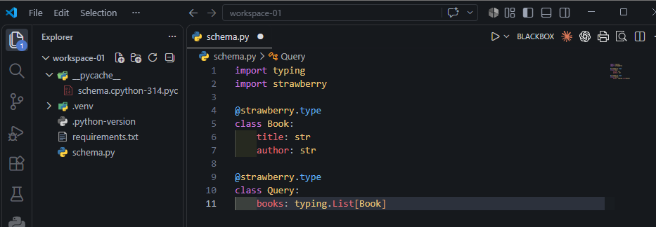

#### Pembahasan

---

2. Definisikan kumpulan data

Contoh fungsi yang mengembalikan beberapa buku

```
def get_books():
    return [
        Book(
            title="The Great Gatsby",
            author="F. Scott Fitzgerald",
        ),
    ]
```

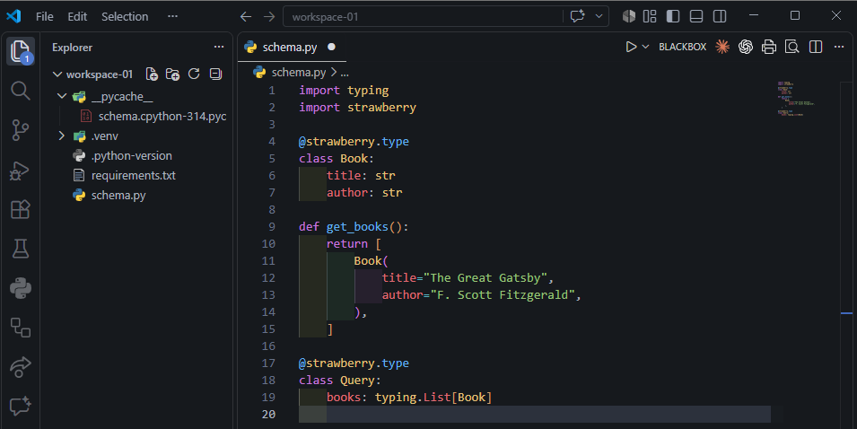

#### Pembahasan

---

3. Mendefinisikan Resolver

Perbarui query pada program schema.py

```
@strawberry.type
class Query:
    books: typing.List[Book] = strawberry.field(resolver=get_books)
```

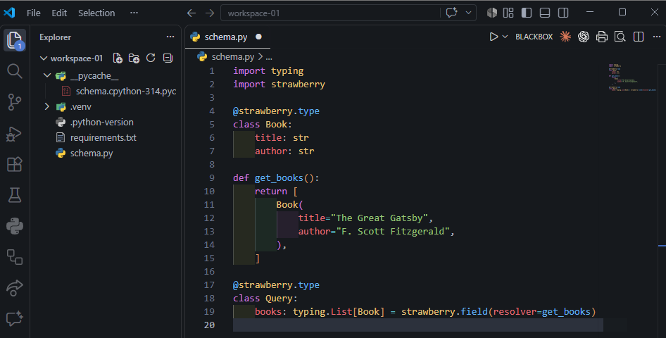

#### Pembahasan

---

4. Buat skema dan jalankan

Untuk membuat skema, tambahkan kode berikut:

```
schema = strawberry.Schema(query=Query)
```

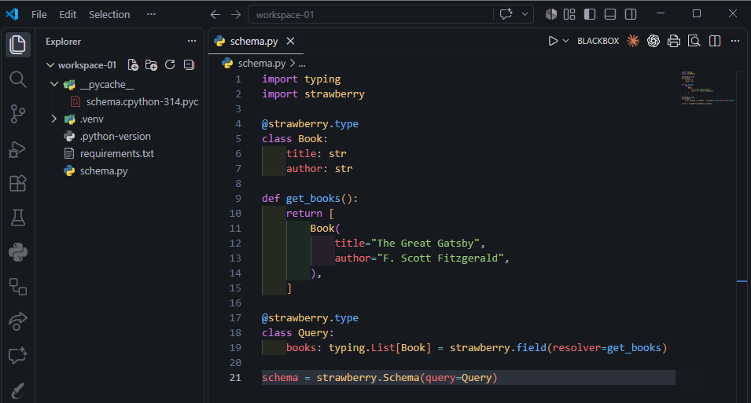

#### Pembahasan

---

Kemudian jalankan dengan perintah

```
strawberry dev schema
```

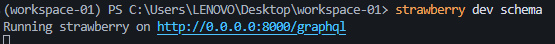

Output yang dihasilkan adalah `Running strawberry on http://0.0.0.0:8000/graphql`

catatan: 0.0.0.0 bisa diganti dengan localhost atau 127.0.0.1

contoh:

```
http://localhost:8000/graphql atau http://127.0.0.1:8000/graphql
```

#### Pembahasan

---

Ketika link tersebut dibuka akan tampil

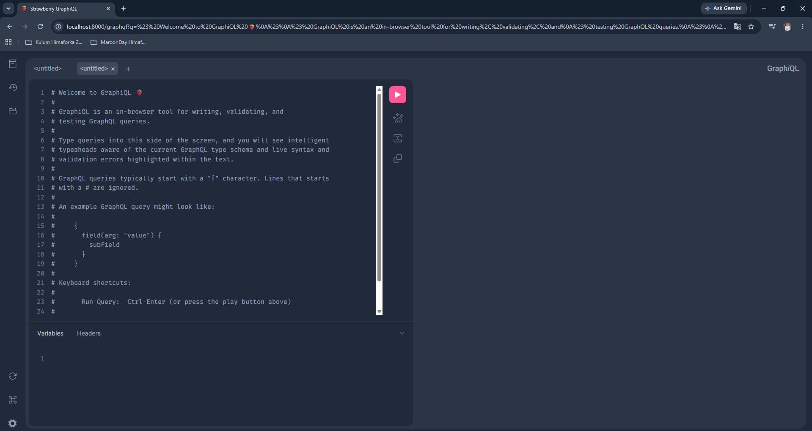

#### Pembahasan

---

Tombol run berikut digunakan untuk menjalankan query


#### Pembahasan

---

5. Pada tempat yang tersedia (di sisi kiri), tuliskan query berikut:

```
{
  books {
    title
    author
  }
}
```

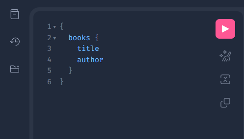

Ketika dijalankan dengan mengklik tombol run. Output yang keluar:

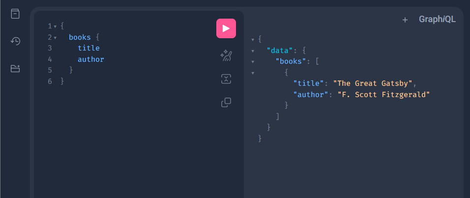

Untuk mematikan server dapat dilakukan dengan cara menekan <CTRL+C> pada shell untuk menjalankan strawberry.

#### Pembahasan

---

# ⏩ PEMBAHASAN TUGAS

1. Buat file bernama client.py

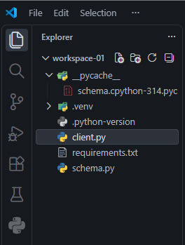

#### Pembahasan

---

2. Isi file dengan kode berikut

```
import requests

url = "http://localhost:8000/graphql"

query = """
{
  books {
    title
    author
  }
}
"""

try:
  response = requests.post(url, json={"query": query})

  if response.status_code == 200:
    data = response.json()
    books = data.get("data", {}).get("books", [])

    print("=== DATA DARI GRAPHQL SERVER ===")
    for book in books:
      print(f"- Judul : {book.get('title')}")
      print(f"- Penulis: {book.get('author')}")
    print("--------------------------------")
  else:
    print(f"Gagal terhubung. Status code: {response.status_code}")

except Exception as e:
  print(f"Terjadi kesalahan: {e}")
```

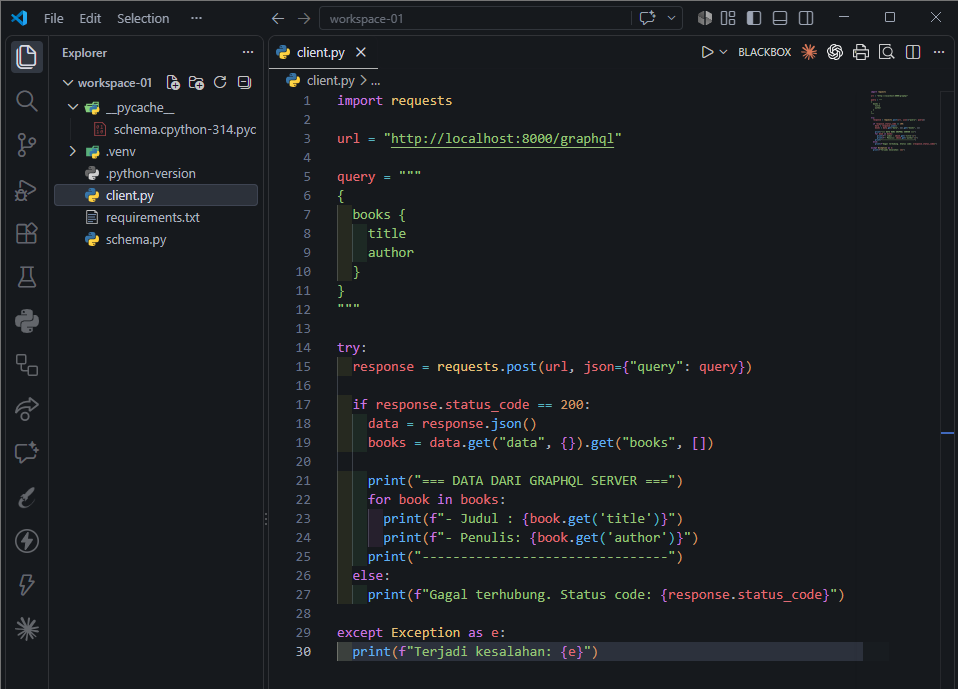

#### Pembahasan

---

3. Jalankan client.py

Gunakan perintah berikut untuk menjalankan client.py

```
python client.py
```

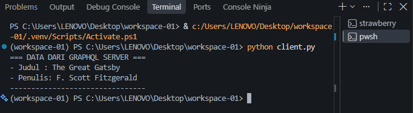

#### Pembahasan

---

# 📝 Kesimpulan

---

## 🗒️ Referensi
