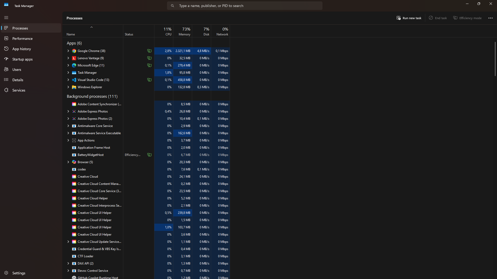

# Praktikum Minggu 02 - Komunikasi Antar Proses pada Sistem Terdistribusi

**Mata Kuliah:** Praktikum Sistem Terdistribusi dan Terdesentralisasi
**Topik:** Komunikasi Antar Proses pada Sistem Terdistribusi

---

# 📚 Tujuan Praktikum

1. ...
2. ....
3. .....

---

# 📚 Dasar Teori

---

# ⏩ PEMBAHASAN PRAKTIKUM

## PRAKTIK 1 - PROSES PADA SATU NODE

### 1. Tampilkan berbagai proses yang ada pada Laptop-Windows

#### Pembahasan

Langkah pertama adalah mengunduh installer Git dari situs resminya di <strong>git-scm.com</strong>. Penting untuk mengambil installer dari sumber resmi agar mendapatkan versi yang terbaru dan aman. Di halaman download, pilih installer sesuai sistem operasi yang digunakan, dalam hal ini dilakukan pada Windows. File yang diunduh biasanya berformat .exe.

---

# 📝 Kesimpulan

Setelah mengikuti seluruh rangkaian praktikum ini, saya jadi paham bahwa Git dan GitHub bukan sekadar tools untuk menyimpan file. Git mencatat setiap perubahan secara terstruktur sehingga kita bisa melacak riwayat proyek, kembali ke versi sebelumnya jika ada kesalahan, dan bekerja tanpa takut merusak file yang sudah ada. GitHub menambahkan dimensi kolaborasi: repo bisa diakses dari mana saja, perubahan bisa ditinjau sebelum digabungkan, dan beberapa orang bisa bekerja dalam satu proyek tanpa saling menimpa.

Kesimpulannya, Git dan GitHub adalah keterampilan dasar yang wajib dimiliki siapa pun yang terjun ke pengembangan software. Praktikum ini memberikan fondasi yang kuat untuk memahami version control dan kolaborasi tim.

---

## 🗒️ Referensi

Materi praktikum mengacu pada dokumentasi Git dan GitHub serta materi petunjuk penggunaan Git dan GitHub dari repository NEO-X-School (https://github.com/NEO-X-School/notes/tree/main/petunjuk-git-github).

